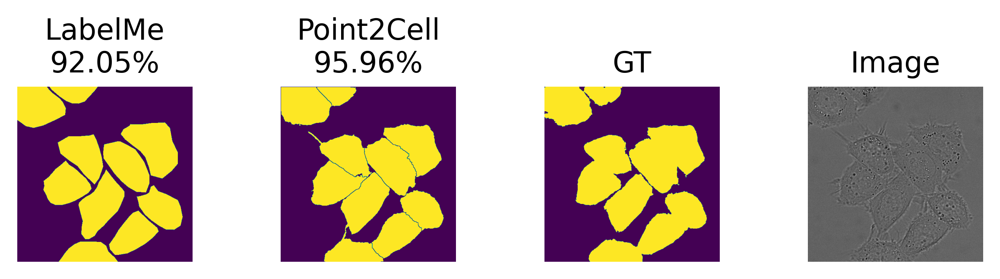
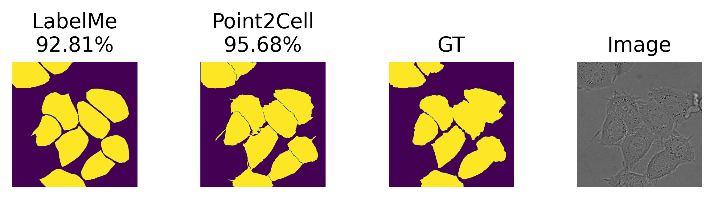

<p align="center">
 
</p>
<h1 align="center">
 Point2Cell:
 
 low-shot learning for interactive biomedical image annotation. Instantiation to stain-free phase-contrast microscopy 
</h1>
<p align="center">
   
   
</p>

## 🛠️ Installation Steps

1. Install anaconda-python (for more details please check https://docs.anaconda.com/anaconda/install/index.html)

2. Clone the repository (this will take some time)

```bash
git clone https://github.com/ounissimehdi/Point2Cell
```

3. Change the working directory

```bash
cd Point2Cell
```

4. Create the point2Cell conda environment with all the dependencies

```bash
conda env create -f environment.yml
```
**Note** that this project is tested on: Windows: 11, MacOS: BigSur and Lunix: Ubuntu 20.04.3 LTS.
 
with the last version of Pytorch ( pytorch 1.10.2:cuda 11.3 and cudnn 8.0 ) to this date.

It supports GPU 😊

5. Activate the point2Cell conda environment

```bash
conda activate point2Cell
```

🌟 You are all set!


## 🥽 How to use Point2Cell -from scratch-:

It is highly recommended to read the paper before getting to use the Point2Cell annotation tool (please do not forget to cite the paper and the github 😊).

In this tutorial, a public dataset will be used, it is called "HeLa cells on a flat glass", it can be downloaded by using the following link (http://data.celltrackingchallenge.net/training-datasets/DIC-C2DH-HeLa.zip).

Some basic information about this dataset :

- Microscope: Zeiss LSM 510 Meta

- Objective lens: Plan-Apochromat 63x/1.4 (oil)

- Pixel size (microns): 0.19 x 0.19

- Time step (min): 10

Make sure you are at the same folder level as the repository Point2Cell/

1. Create the dataset folder and prepare the dataset

```bash
mkdir dataset
cd dataset

mkdir hela_cells_dataset
cd hela_cells_dataset

wget http://data.celltrackingchallenge.net/training-datasets/DIC-C2DH-HeLa.zip
unzip DIC-C2DH-HeLa

rm DIC-C2DH-HeLa.zip

cd ../../
```
**Note** that the folder (dataset\hela_cells_dataset\DIC-C2DH-HeLa\01) with 84 images will be used for training/validation, and the folder (dataset\hela_cells_dataset\DIC-C2DH-HeLa\02) with another 84 images will be used for testing.

At the end of this step you should have:

```
tree
YOUR_PATH_TO_MAIN_FOLDER:.
├───dataset
│   └───hela_cells_dataset
│       └───DIC-C2DH-HeLa
│           ├───01
│           ├───01_GT
│           │   ├───SEG
│           │   └───TRA
│           ├───01_ST
│           │   └───SEG
│           ├───02
│           ├───02_GT
│           │   ├───SEG
│           │   └───TRA
│           └───02_ST
│               └───SEG
└───Point2Cell
    ├───annotation_interface
    ├───demo
    ├───experiments
    ├───labelme_utils
    ├───train_models
    │   └───hela_cells
    │       └───runs
    ├───unet
    └───utils

```
2. Prepare HeLa cells dataset train/validation/test splits after data-augmentation

```bash
cd Point2Cell/
jupyter-notebook
```
   a. Please open **hela_data_preparation.ipynb** inside the Point2Cell, your browser should open with a link similar to this one (http://localhost:8888/notebooks/hela_data_preparation.ipynb).

   b. Execute all cells on the notebook, this notebook will apply data-augmentation to the training/validation data.

At the end of this step you should have:

```
tree
YOUR_PATH_TO_MAIN_FOLDER:.
├───dataset
│   ├───augmented_hela_cells_dataset
│   │   ├───test
│   │   ├───train
│   │   └───val
│   └───hela_cells_dataset
│       └───DIC-C2DH-HeLa
│           ├───01
│           ├───01_GT
│           │   ├───SEG
│           │   └───TRA
│           ├───01_ST
│           │   └───SEG
│           ├───02
│           ├───02_GT
│           │   ├───SEG
│           │   └───TRA
│           └───02_ST
│               └───SEG
└───Point2Cell
    ├───annotation_interface
    ├───demo
    ├───experiments
    ├───labelme_utils
    ├───train_models
    │   └───hela_cells
    │       └───runs
    ├───unet
    └───utils

```
Since tha data is ready!
- All train/validation dataset images :  84 (672 images with data-augmentation)
   - (80%) train         images :  67 (536 images with data-augmentation)
   - (20%) validation    images :  17 (136 images with data-augmentation)

- Test dataset contain 84 images and their ground truth masks.

Now we can start training the two U-Net models ('intra cellular density' and 'cell mask predictor').

3. rain/validate then test the U-Net -cell mask predictor- model
```bash
cd Point2Cell/train_models/hela_cells/
conda activate point2Cell
python bn_mask_train_unet.py   
```

4. Train/validate then test the U-Net -intra cellular density- model
```bash
cd Point2Cell/train_models/hela_cells/
conda activate point2Cell
python density_mask_train_unet.py   
```

5. Check the training/validation and testing details inside (./Point2Cell/experiments/YOUR_EXP_NAME/logfile.log)

**Note** that this project support the TensorBoard, all records can be found inside (./Point2Cell/train_models/hela_cells/runs).

```bash
cd Point2Cell/train_models/hela_cells/
tensorboard --logdir runs
```
Happy visualization 😎!!

6. Compute density maps and cell masks
```bash
cd Point2Cell/annotation_interface/
jupyter-notebook  
```
   a. Please open **novel_data_prep.ipynb** inside the (./Point2Cell/annotation_interface/) folder, your browser should open with a link similar to this one (http://localhost:8888/notebooks/novel_data_prep.ipynb).

   b. Execute all cells on the notebook, this notebook will apply load the best models already trained and use them to compute the density maps and cell masks for the novel data (test dataset).

At the end of this step you should have:
```
tree
YOUR_PATH_TO_MAIN_FOLDER:.
C:.
├───dataset
│   ├───augmented_hela_cells_dataset
│   │   ├───test
│   │   ├───train
│   │   └───val
│   └───hela_cells_dataset
│       ├───DIC-C2DH-HeLa
│       │   ├───01
│       │   ├───01_GT
│       │   │   ├───SEG
│       │   │   └───TRA
│       │   ├───01_ST
│       │   │   └───SEG
│       │   ├───02
│       │   ├───02_GT
│       │   │   ├───SEG
│       │   │   └───TRA
│       │   └───02_ST
│       │       └───SEG
│       └───novel_annotation
│           ├───binary_masks
│           ├───density_masks
│           └───images
└───Point2Cell
    ├───annotation_interface
    ├───demo
    ├───experiments
    ├───labelme_utils
    ├───train_models
    │   └───hela_cells
    │       └───runs
    ├───unet
    └───utils
```

7. Start the annotation of the novel dataset
```bash
cd Point2Cell/annotation_interface/
python annotation_tool.py 
```
<p align="center">  </p>

Enjoy😊!
## 🔬 Quantitative results:
The best model is based on the smallest validation loss.
### **HeLa dataset: Cell mask predictor (binary masks):**

|data-split/metrics     	|Mean BCE Loss	|DICE	         |PRECISION	   |RECALL	     |ACCURACY       |
|--------------------------|--------------|--------------|--------------|-------------|---------------|
|Test	                     |0.151±0.0121  |93.92%±0.5107	|96.30%±0.4860	|91.77%±1.3294|93.81%±0.4777  |
|Validation                |0.1237±0.0026 |94.88%±0.0606 |93.82%±0.4604 |96.02%±0.5218|94.85%±0.0798  |

**Detailed results on the test dataset:**
|Cross-validation/metrics	|Mean BCE Loss	|DICE	      |PRECISION	|RECALL	|ACCURACY|
|--------------------------|--------------|-----------|-----------|--------|--------|
|FOLD 1	                  |0.1644	      |93.40%	   |97.14%	   |90.00%	|93.37%  |
|FOLD 2	                  |0.1414	      |94.36%	   |96.05%  	|92.90%	|94.23%  |
|FOLD 3	                  |0.1348      	|94.58%	   |96.09%  	|93.18%	|94.43%  |
|FOLD 4	                  |0.1493      	|94.01%	   |95.73%  	|92.42%	|93.86%  |
|FOLD 5	                  |0.1651      	|93.29%	   |96.51%  	|90.35%	|93.19%  |

**Detailed results on the validation:**
|Cross-validation/metrics	|Mean BCE Loss	|DICE	      |PRECISION	|RECALL	|ACCURACY|
|--------------------------|--------------|-----------|-----------|--------|--------|
|FOLD 1	                  |0.1260      	|94.86%	   |94.29%  	|95.48%	|94.79%  |
|FOLD 2	                  |0.1219	      |94.93%	   |93.49%	   |96.50%	|94.86%  |
|FOLD 3	                  |0.1252	      |94.93%	   |93.26%	   |96.72%	|94.83%  |
|FOLD 4	                  |0.1263	      |94.77%	   |93.64%	   |95.98%	|94.80%  |
|FOLD 5	                  |0.1195        |94.91%	   |94.44%	   |95.43%	|95.01%  |

### **HeLa dataset: Intra-cellular density predictor:**

|data-split/metrics     	|Mean MSE 	     |
|--------------------------|----------------|
|Test	                     |0.03164±0.0028  |
|Validation                |0.0252±0.0004   |

**Detailed results on the test dataset:**
|Cross-validation/metrics	|Mean MSE   |
|--------------------------|-----------|
|FOLD 1	                  |0.0338     |
|FOLD 2                  	|0.0295     |
|FOLD 3	                  |0.0274     |
|FOLD 4                  	|0.0350     |
|FOLD 5                  	|0.0325     |

**Detailed results on the validation:**
|Cross-validation/metrics	|Mean MSE   |
|--------------------------|-----------|
|FOLD 1	                  |0.0256     |
|FOLD 2                    |0.0258     |
|FOLD 3                    |0.0252     |
|FOLD 4                  	|0.0249     |
|FOLD 5                  	|0.0246     |

## 🆚 Point2Cell (our tool) VS LabelMe (polygon based annotation tool):


### **Qualitative results**:
Some examples annotated by [LabelMe](https://github.com/wkentaro/labelme) and [Point2Cell](https://github.com/ounissimehdi/Point2Cell) respectively, compared to the ground truth (DICE coefficient percentage).
<p align="center">
   
   
</p>

**Annotation speed comparison between Point2Cell and LabelMe:**
<p align="center">
   
</p>


### **Quantitative results**:
|                                |Time per image            |Average Dice coefficient  |
|--------------------------------|--------------------------|--------------------------|
|**Point2Cell (our tool)**       |**14.6 sec (std 1.35sec)**|**94.97% (std 0.88%)**    |
|LabelMe                         |96.1 sec (std 8.03sec)    |91.30% (std 0.90%)        |

**Detailed results:**

|               |LabelMe     |       |Point2Cell  |        |
|---------------|------------|-------|------------|--------|
|images/metrics |Time (sec)  |DICE   |Time (sec)  |DICE    |
|img_0          |108         |92.05% |13          |95.96%  |
|img_1          |95          |92.81% |13          |95.68%  |
|img_2          |108         |91.52% |15          |95.14%  |
|img_3          |87          |90.2%  |14          |94.31%  |
|img_4          |85          |91.32% |15          |95.59%  |
|img_5          |88          |90.69% |14          |93.64%  |
|img_6          |102         |91.66% |16          |94.08%  |
|img_7          |99          |89.7%  |17          |93.71%  |
|img_8          |90          |92.2%  |16          |95.76%  |
|img_9          |99          |90.94% |13          |95.87%  |

